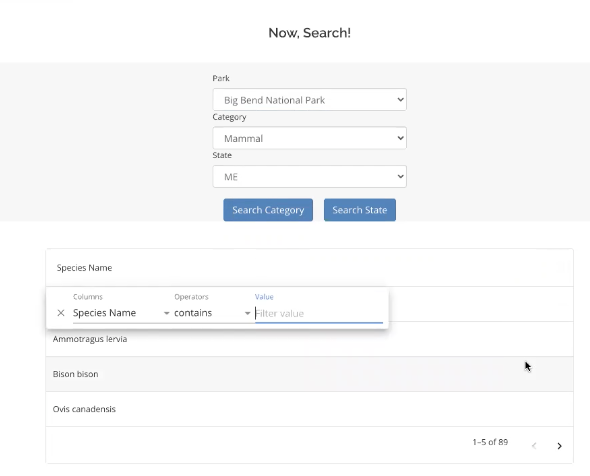
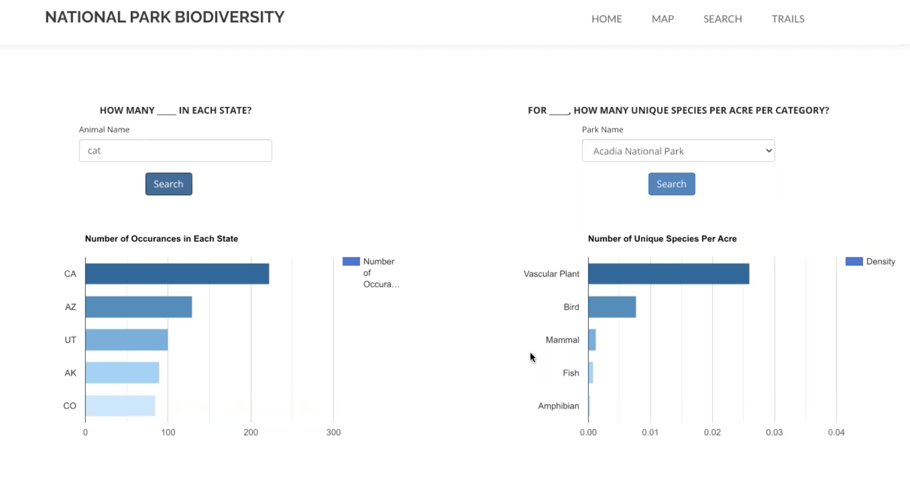
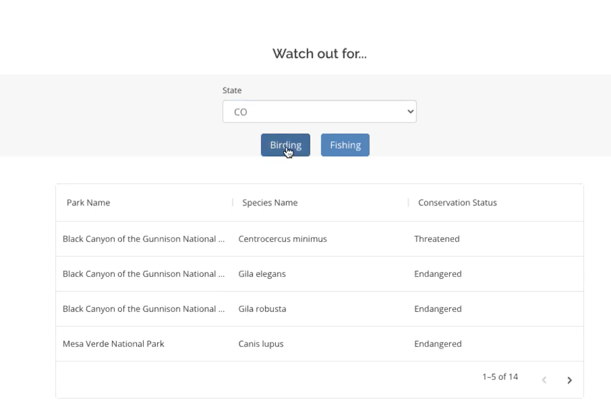

# National Park Biodiversity

  Wildlife preservation has always been a hot topic these days. We would like to create a web application for biologists, geo-lovers and hikers to explore both the national park and the biodiversity info in the United States so that they can have a better understanding of what to expect when planning their trips.
  
  The website allows the users to locate the parks on an interactive map which provides a summary of the parks and states. They can also look for the total numbers of distinct species grouped by categories of a selected park on the map at the macroscopic level. Moreover, by providing a filtering feature, the website is also capable of displaying relevant info of species. Users can search by any combinations they would prefer, either by state, park, or species. Furthermore, if the user is interested in acquiring deeper knowledge of the park and species, they can expect a comprehensive summary of a statistical analysis of the species population he/she is looking for on the website (i.e. density, occurrence in each state). Last but not least, we also include details about national park trails for hikers to preview, combining the biodiversity facts.
	
  In conclusion, the website serves as an relatively exhaustive user guide for nature lovers, providing useful instructions so that they can enjoy their trips while learning about birds, plants, mammals and geology.
  

## How to run locally
1. Use VisioStudio Code or any IDE to open the repository.
2. Open two terminals: `cd server` and `cd client`
3. In the server terminal, run `npm install`
4. In the client terminal, run `npm install`
5. In the server terminal, run `npm start`
6. In the client terminal, run `npm start`
7. This will open up a react app @localhost:3000


## SQL queries highlights (Optimize queries to reduce frontend response time)
```sql
/* List parks and endangered bird species in parks with specified state */
WITH birding_park
	AS (SELECT DISTINCT park.park_name AS park_name
		FROM park
			JOIN (SELECT a.park_name AS park
				FROM activities a
				WHERE a.activity_name = 'birding') x
			   ON x.park = park.park_name
		WHERE park.state = '${state}'), species_park
	AS (SELECT park.park_name AS park_name,
		a.scientific_name AS species_name,
		a.conservation_status
            FROM park SELECT
		JOIN (SELECT s.park_name AS park,
			     s.conservation_status,
			     s.scientific_name
		      FROM species s
		      WHERE s.conservation_status = 'Endangered'
				OR s.conservation_status = 'Species_of_concern'
				OR s.conservation_status = 'Threatened' AND s.category = 'Bird') a
		       ON a.park = park.park_name
			 WHERE park.state = '${state}')
SELECT s.park_name AS park_name, s.species_name, s.conservation_status
FROM birding_park b
	JOIN species_park s
	  ON s.park_name = b.park_name
GROUP BY s.park_name,
	 s.species_name,
	 s.conservation_status
	 species_of_concern
```


## UI
Login


Home


Features


Interactive Map


Search trails


Count - How many xx?


Learn more about Species!



